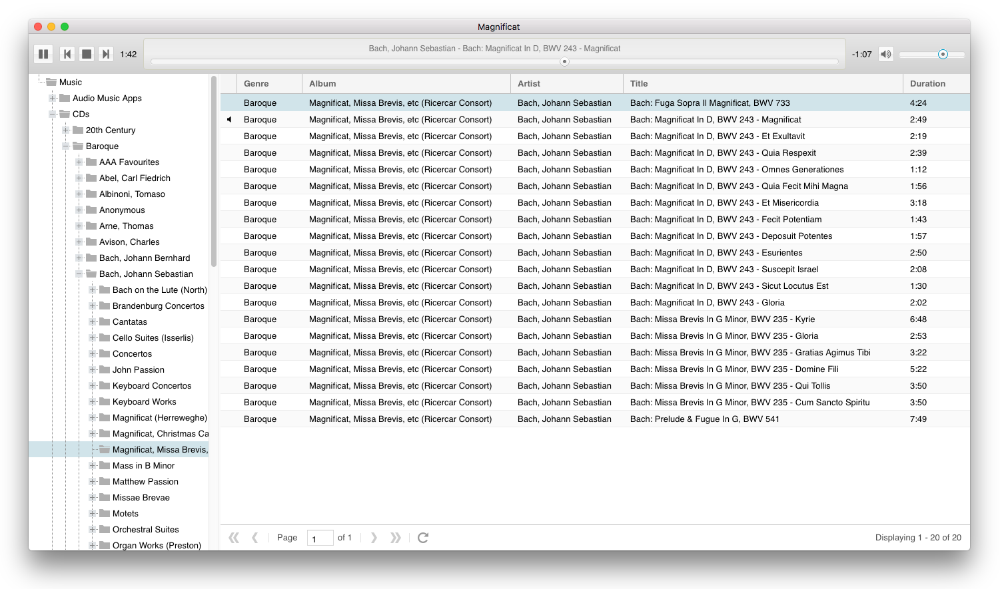

# Magnificat

Magnificat was intended to become a fully featured cataloguing app for classical music enthusiasts with large CD collections to organise. I was going to write it in Electron using Ext JS but have since decided to use Java FX instead. This repository is being retained for the sake of curiosity. Here's what it looks like:



There are no binaries to download (you need to be a programming enthusiast to check it out and use it).

### Version 0.1
- This is the first and last release of the Electron/Ext-JS version of the app (a Java FX version will be available in the coming months).
- Use Electron and Ext JS to create an interface allowing users to open multiple tabs.
- Allow users to browse/play music on the filesystem.

## Pre-requisites

There are no binaries uploaded to this repository, so you will need the following in order to compile and run the source (in addition to being a developer of some kind who isn't afraid to compile something!):

- Sencha Ext JS 6.2.0 [GPL v3 version](https://www.sencha.com/legal/GPL/)
- [Sencha Cmd](https://www.sencha.com/products/sencha-cmd/) 6.5.1+ build tool
- [Node.js](https://nodejs.org/) 6.11+
- [Electron](https://github.com/electron/electron) 1.7.6+ (installed via [npm](https://www.npmjs.com/))

## Quick Start

```
$ git clone https://github.com/mfearby/magnificat.git
$ cd magnificat
$ npm install
```

Extract a copy of the Ext JS framework into the client/ext folder

```
$ cd client
$ sencha app build development
$ cd ..
$ npm run plain
```

After cloning the repository you should "npm run plain" because the default "npm start" loads the built version of the Ext JS application, which you won't have yet.

## Building the Ext JS app

The built/minified version of the app is generated and copied to the client_build folder

### Mac/Linux
```
$ chmod 755 buildext.sh
$ ./buildext.sh
```

### Windows
```
C:\magnificat> ./buildext
```

## Packaging the Electron app with Ext JS

The package script calls the existing build script (above) to minify the Ext JS app then calls the [Electron Packager](https://github.com/electron-userland/electron-packager) script to bundle everything together with Electron for distribution.

### Mac/Linux
```
$ chmod 755 package.sh
$ ./package.sh
```

### Windows
```
C:\magnificat> ./package
```

## Author
Marc Fearby
- [marcfearby.com](http://marcfearby.com)
- [@marcfearby](https://twitter.com/MarcFearby)
